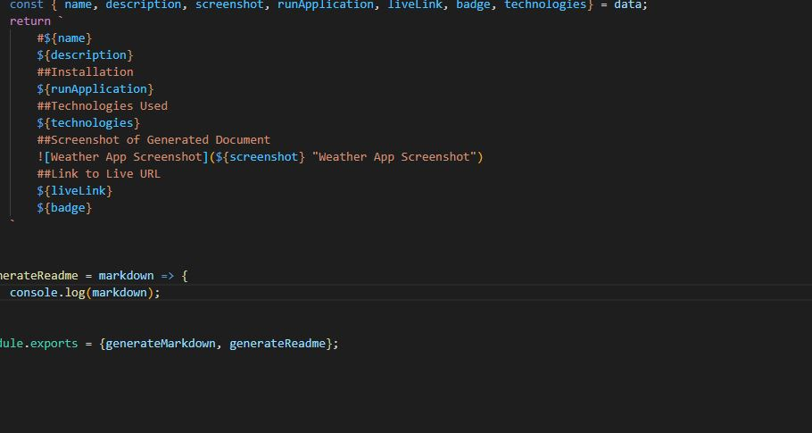

# License

 This project covered under the Apache license.

# readme generator

## Description

it generates readmes

## Table of Contents

* [Installation](#installation)

* [Usage](#usage)

* [Contributing](#contributing)

* [Testing](#testing)

* [Screenshot](#screenshot)

* [Questions](#questions)

## Installation

node index.js

## Usage

it should be used to make readmes

## Contributing

open github branch

## Testing

undefined

## Screenshot of Generated Document

## Link to Live URL

www.google.com
        

## Questions

Send questions to email ericyoung111@gmail.com or check out my [GitHub profile.](www.github.com/readme-generator)
    